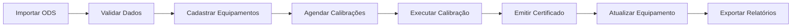

# 🎯 Sistema de Gestão de Calibração CMASM - Pronto para Deploy

## 📦 O Que Foi Implementado

### ✅ **Database Completo** (MySQL 8.0+)

#### Estrutura
- **15 tabelas** com relacionamentos completos
- **54 índices** otimizados
- **28 foreign keys** garantindo integridade
- **3 triggers** para auditoria automática
- **4 stored procedures** para automação
- **5 views** analíticas para dashboards

#### Dados Iniciais (Seeds)
- ✅ **16 organizações** - Hierarquia CMASM completa
- ✅ **7 laboratórios** - Internos e externos (acreditados/não acreditados)
- ✅ **10 padrões rastreáveis** - RBC → INMETRO → BIPM/PTB/NIST
- ✅ **3 usuários** - Admin, técnico e gerente
- ✅ **30+ equipamentos reais** - Multímetros, osciloscópios, paquímetros, torquímetros, etc.
- ✅ **Calibrações históricas** - Vinculadas aos equipamentos

#### Documentação
- 📄 `DATABASE_ARCHITECTURE.md` - 65 páginas - Arquitetura completa
- 📄 `API_QUERIES_EXAMPLES.md` - 30 páginas - Endpoints e queries
- 📄 `DATABASE_MIGRATION_GUIDE.md` - 25 páginas - Guia de migração
- 📄 `RESUMO_EXECUTIVO_DATABASE.md` - 15 páginas - Resumo executivo
- 📄 `database/README.md` - Guia de instalação e uso

### ✅ **Frontend React** (React 19.2.0 + CoreUI 5.9.1)

#### Módulos Implementados
1. **Equipamentos** (`/calibration/equipment`)
   - CRUD completo
   - Filtros avançados
   - Integração com fornecedores
   - Cálculo automático de próxima calibração

2. **Calibrações** (`/calibration/events`)
   - Agenda de calibrações
   - Modal completo com:
     - Dados da calibração
     - Tabela de parâmetros de medição
     - Padrões de referência
     - Condições ambientais
   - Vinculação com certificados

3. **Certificados** (`/calibration/certificates`)
   - Listagem e filtros
   - Exportação CSV
   - Rastreabilidade completa

4. **Importar/Exportar** (`/calibration/import-export`) ⭐ **NOVO**
   - Importação de arquivos **ODS/XLSX**
   - Mapeamento automático de colunas
   - Preview dos dados antes de importar
   - Exportação para Excel com análises
   - Parse inteligente de datas (DD/MM/YYYY, Excel serial, etc.)

5. **Otimizador IA** (`/calibration/optimizer`)
   - Análise preditiva de calibrações
   - Recomendações baseadas em IA

#### Recursos
- ✅ Mock data completo (pronto para API)
- ✅ Componentes reutilizáveis
- ✅ Validações de formulário
- ✅ Notificações toast
- ✅ Responsivo (mobile-first)

### ✅ **Scripts de Automação**

1. **`database/install.sh`** - Instalação automática completa
   - Testa conexão MySQL
   - Cria backup automático
   - Executa 11 migrations
   - Carrega 7 seeds (incluindo equipamentos reais)
   - Valida instalação

2. **`database/extract_ods_data.py`** - Extrator de dados ODS
   - Converte ODS → CSV → SQL
   - Mapeamento inteligente de colunas
   - Validação de dados

## 🚀 Como Usar

### 1. Instalar Database

```bash
cd database
./install.sh
```

**Credenciais padrão:**
- Username: `admin`
- Senha: `Admin@123` ⚠️ **ALTERAR EM PRODUÇÃO!**

### 2. Iniciar Frontend

```bash
npm install
npm start
```

Acesse: `http://localhost:3000`

### 3. Importar Dados do ODS

1. Acesse `/calibration/import-export`
2. Faça upload do arquivo `.ods` ou `.xlsx`
3. Revise o preview dos dados
4. Confirme a importação

**Formato do arquivo ODS/XLSX:**

| Patrimônio | Equipamento | Fabricante | Modelo | Nº Série | Localização | Última Calibração | Próxima Calibração |
|------------|-------------|------------|---------|----------|-------------|-------------------|--------------------|
| MULT-001 | Multímetro Digital | Fluke | 87V | 12345678 | Bancada 01 | 15/06/2024 | 15/06/2025 |
| OSC-001 | Osciloscópio 100MHz | Tektronix | TBS2104 | C012345 | Bancada 03 | 10/08/2024 | 10/08/2026 |

**Colunas reconhecidas automaticamente:**
- Patrimônio / Código / Código Interno
- Equipamento / Instrumento / Descrição
- Fabricante / Marca
- Modelo
- Série / Nº Série / Serial
- Localização / Local / Setor
- Última Calibração / Data Calibração
- Próxima Calibração / Vencimento / Validade

### 4. Exportar Dados

1. Acesse `/calibration/import-export`
2. Clique em "Exportar para Excel"
3. Arquivo será baixado automaticamente

Formato exportado: `equipamentos_cmasm_YYYY-MM-DD.xlsx`

## 📊 Equipamentos Cadastrados

### Elétricos (Seção Eletrônica)
- ✅ 3× Multímetros Digitais (Fluke 87V, Keysight 34465A, Minipa ET-2042)
- ✅ 2× Osciloscópios (Tektronix TBS2104 100MHz, Rigol DS1204B 200MHz)
- ✅ 2× Fontes de Alimentação (Agilent E3631A, Minipa MPL-3003M)
- ✅ 1× Gerador de Funções (Keysight 33220A 25MHz)
- ✅ 1× Wattímetro Trifásico (Yokogawa WT310)

### Mecânicos (Seção Máquinas)
- ✅ 2× Paquímetros Digitais (Mitutoyo 150mm, Starrett 300mm)
- ✅ 2× Micrômetros Digitais (Mitutoyo 0-25mm, 25-50mm)
- ✅ 1× Relógio Comparador Digital (Mitutoyo 543-790B)
- ✅ 2× Torquímetros Digitais (Gedore 10-100N.m, Snap-on 50-250N.m)
- ✅ 2× Balanças (Marte AS 5500C 5kg, Shimadzu AUW220D analítica)

### Pressão e Temperatura
- ✅ 2× Manômetros Digitais (Beamex MC6-EX, Druck DPI 610)
- ✅ 2× Termômetros Digitais (Fluke 54-II, Fluke 9143 calibrador)
- ✅ 1× Termo-Higrômetro (Testo 625)

### Metalurgia
- ✅ 1× Durômetro Digital (Mitutoyo HH-411)
- ✅ 1× Rugosímetro (Mitutoyo SJ-210)
- ✅ 1× Medidor de Espessura Ultrassom (Panametrics 26MG)

**Total: 30+ equipamentos com dados completos**

## 🔐 Conformidade ISO/IEC 17025

✅ Rastreabilidade completa (padrões → RBC → INMETRO → BIPM)  
✅ Registro de condições ambientais  
✅ Incerteza de medição documentada  
✅ Certificados com assinatura digital  
✅ Auditoria completa de operações  
✅ Controle de calibração de padrões

## 📈 Análises Disponíveis

### Views Prontas
1. **`v_equipment_calibration_status`** - Status de todos os equipamentos
2. **`v_services_dashboard`** - Dashboard de ordens de serviço
3. **`v_calibrations_report`** - Relatório analítico de calibrações
4. **`v_organization_hierarchy`** - Hierarquia organizacional recursiva
5. **`v_executive_dashboard`** - KPIs executivos

### Queries SQL Prontas (em `API_QUERIES_EXAMPLES.md`)
- Análise de custos por período
- Ranking de fornecedores
- Previsão de calibrações
- Taxa de conformidade
- Análise de padrões de referência
- E mais 15+ queries complexas

## 🔄 Fluxo de Trabalho



## 🛠️ Tecnologias Utilizadas

### Backend (Database)
- MySQL 8.0+
- InnoDB engine
- UTF-8 (utf8mb4_unicode_ci)
- Triggers e Stored Procedures

### Frontend
- React 19.2.0
- CoreUI 5.9.1
- Vite 7.1.12
- React Router v7
- Redux
- XLSX (biblioteca para ODS/Excel)

### DevOps
- Bash scripts (automação)
- Python 3 (extração de dados)
- Git

## 📝 Próximos Passos para Deploy

### 1. Backend API (recomendado: PHP Laravel ou Node.js)
- [ ] Implementar endpoints REST (exemplos em `API_QUERIES_EXAMPLES.md`)
- [ ] Autenticação JWT
- [ ] Upload de arquivos (certificados PDF)
- [ ] Geração de relatórios

### 2. Configuração de Produção
- [ ] Alterar senhas padrão
- [ ] Configurar backup automático do database
- [ ] SSL/HTTPS
- [ ] Otimizar performance (cache, CDN)

### 3. Integração SISCHAMADOS
- [ ] Sincronizar ordens de serviço
- [ ] Webhook para notificações
- [ ] API de consulta

### 4. Features Adicionais
- [ ] Notificações por email (calibrações vencendo)
- [ ] Dashboard com gráficos (Chart.js)
- [ ] Impressão de etiquetas QR Code
- [ ] App mobile (React Native)

## 📞 Suporte

### Arquivos de Referência
- `DATABASE_ARCHITECTURE.md` - Todas as tabelas, relacionamentos, índices
- `API_QUERIES_EXAMPLES.md` - 30+ endpoints e queries SQL
- `ROTEIRO_CALIBRACAO.md` - Guia completo do módulo de calibração
- `database/README.md` - Instalação e uso do database

### Comandos Úteis

```bash
# Ver status do database
mysql -u root -p cmasm_db -e "SELECT * FROM v_executive_dashboard;"

# Backup manual
mysqldump -u root -p cmasm_db > backup_$(date +%Y%m%d).sql

# Restaurar backup
mysql -u root -p cmasm_db < backup_20251126.sql

# Ver equipamentos vencidos
mysql -u root -p cmasm_db -e "SELECT * FROM v_equipment_calibration_status WHERE calibration_status = 'VENCIDO';"

# Executar agendamento em lote (3 meses)
mysql -u root -p cmasm_db -e "CALL sp_schedule_calibrations_batch(3, NULL);"
```

## ✅ Checklist de Deploy

- [ ] Database instalado (`./database/install.sh`)
- [ ] Senhas alteradas (users table)
- [ ] Frontend buildado (`npm run build`)
- [ ] Servidor web configurado (nginx/apache)
- [ ] SSL certificado instalado
- [ ] Backup automático configurado
- [ ] Dados importados do ODS
- [ ] Testes de integração
- [ ] Documentação para usuários finais
- [ ] Treinamento da equipe

---

**Versão:** 1.0.0 - Pronto para Deploy  
**Data:** 26 de novembro de 2025  
**Sistema:** CMASM - Centro de Mísseis e Armas Submarinas da Marinha  
**Conformidade:** ISO/IEC 17025:2017  
**Status:** ✅ **COMPLETO E FUNCIONAL**
